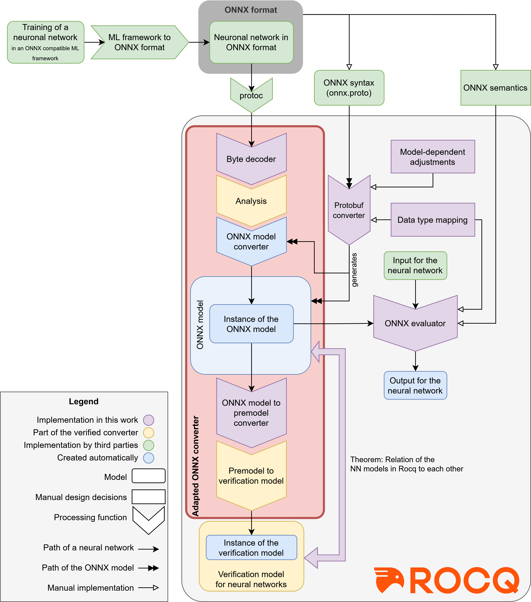

# A formalization of the ONNX-format in Rocq for the verification of neural networks

The formalization comes in two parts: The formalization of the ONNX-syntax and the formalization of the ONNX-semantics.

* The formalization of the ONNX-syntax is called the ONNX-Model and is found in `out/model.v`, which is generated by the *Protobuf-Converter*. It can be found in the folder `protobuf_converter`.
* The formalization of the ONNX-semantics is called the ONNX-Evaluator and is found in the folder `onnx_evaluator`.
* An updated version of the [verified converter](https://github.com/verinncoq/converter) is also part of the repository. It uses both the ONNX-Model and the ONNX-Evaluator, and is much more trustworthy than it's original release.
It is found in the folder `onnx_converter`. 

## Requirements

* The Coq Proof Assistant, version 8.20.1, compiled with OCaml 4.12.2
* Flocq 4.2.1
* Coquelicot Version 3.4.4
* protoc 3.21.7
* Python 3.11.2
* numpy 1.25.0
* onnxruntime 1.15.1
 
Python packages for experiments:
* torch 2.9.1 and torchvision 0.24.1
* onnx 1.20.0 and onnxscript 0.5.7

## Build

To compile, run `scripts/compile.sh` resp. `scripts/compile.ps1`. You can also manually compile all files with `coqc`.

## Use

* To use the ONNX-Model, you may have a look at the file `out/model.v`.
* To use the ONNX-Evaluator, you may have a look at the file `onnx_evaluator/usage.v`.
* To use the updated [verified converter](https://github.com/verinncoq/converter), you may run `./scripts/convert.sh -n input` resp. `scripts/convert.ps1 -net input`, where `input.onnx` must be an ONNX-file.
You may also run `./scripts/convert.sh -n input -o onnx_model` resp. `scripts/convert.ps1 -net input -out onnx_model` to get an instance of the ONNX-Model.

## Flowchart

